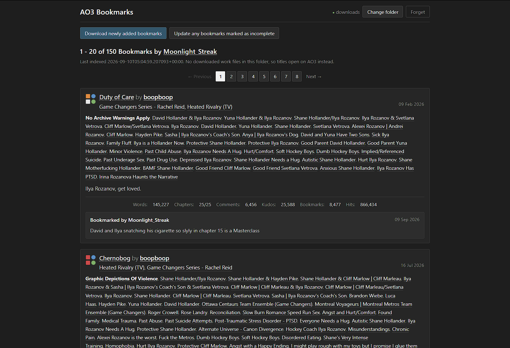

# Alex Tips

Download and view saved fanfic as an Angular web app. Can be ran entirely locally.



Downloads go to the library you open in the page: a folder you choose on this computer, or
your Dropbox app folder (`/Apps/ao3-downloader`). The page reads and writes that library
itself, so keep it open while a run is going. There is no `DownloadFolder` setting any more.

## Development Build  
settings.ini can be found in the powershell_source directory
EnableDebugTools=true can be set in settings.ini

- if you make dev changes to website, you can just hot-reload.
- if you make dev changes to downloader process (python files), you will need to restart the worker (exit any running processes in powershell, then read section below on how to Build & Run the project again)

## Build & Run Project

### Build - How to bundle it

(it's worth running uv run python dev/readme.py after a rewrite.(?))

Open powershell in the root directory:
powershell.exe -ExecutionPolicy Bypass -File .\generate_build_artifacts.ps1

Everthing gets bundled to the /build folder.

### Run - How to run the build artifact

Open powershell in the /build directory:
powershell.exe -ExecutionPolicy Bypass -File .\Start-Application.ps1

This starts the local download helper on port 4400 and the web UI on port 4200
Leave the window open and go to http://localhost:4200.

## Run development files:

### Running GUI + python helper locally, wihtout building artifacts
Open powershell
powershell.exe -ExecutionPolicy Bypass -File .\run_development_build.ps1
That starts both pieces — the local helper on port 4400 and the web UI on port 4200 — then leave the window open and go to http://localhost:4200.

Ctrl+C in that window stops both

### For running the GUI ONLY:

Open git bash CLI window, 

From the repo root:
npm --prefix GUI start
(or, cd GUI; npm start)

Then open http://localhost:4200.


# Original Readme

> **Out of date for this fork.** The console program described below has been removed - the
> menu, its actions, and the ebook parsing only they used are all gone, so the install and
> menu instructions in this section no longer apply here. What remains is the local helper
> and the web UI documented above. This section is kept for provenance: it is the readme of
> [the upstream project](https://github.com/nianeyna/ao3downloader) this was forked from, and
> it still describes that project accurately.

## What is this?

This is a program intended to help you download fanfiction from the [Archive of Our Own](https://archiveofourown.org/) in bulk. This program is primarily intended to work with links to the Archive of Our Own itself, but has a secondary function of downloading any [Pinboard](https://pinboard.in/) bookmarks that link to the Archive of Our Own. You can ignore the Pinboard functionality if you don't know what Pinboard is or don't use Pinboard.

## Quick Start

Dislike reading? Go directly to either [Windows install](https://nianeyna.github.io/ao3downloader/windows) or [Mac and Linux install](https://nianeyna.github.io/ao3downloader/mac-linux).

## Table of Contents

- [Announcements](#announcements): List of changes that may be of note for returning users (not a complete changelog).
- [Instructions](#instructions): How to install and run ao3downloader.
- [Menu Options](#menu-options-explanation): Explanation of the options you will see when you start ao3downloader and what they do. Note that most of these options will in turn present you with a series of prompts. These should largely be self-explanatory, however, if you are confused by any of the prompts your question may be answered in the [notes](#notes).
- [Notes](#notes): Explanation of some of ao3downloader's features and quirks that may not be immediately obvious. I recommend reading this.
- [Known Issues](#known-issues): List of bugs that I know about but haven't yet been able to fix. If you encounter strange behavior, there may be a workaround here.
- [Troubleshooting](#troubleshooting): If you encounter a problem running the script, please read this section carefully and do any relevant steps in order to the best of your ability before sending a bug report.
- [Contact](#questions-comments-bug-reports): How to get in contact with me. Don't be shy!

## Announcements

New, easier installation instructions are here! You no longer need to install python manually (no more version worries) or unzip any folders or any of that stuff. Just download and run one file. Plus, it can detect updates to the script and install them for you, so you don't have to check back here for updates anymore!

## Instructions

### Install Automatically

For the easiest experience, click on one of these links based on your operating system:

[Windows](https://nianeyna.github.io/ao3downloader/windows)

[Mac or Linux](https://nianeyna.github.io/ao3downloader/mac-linux)

This will take you to a page that contains a downloadable installation script and some instructions for how to use it. (They're very simple instructions, I promise.)

### Install With PyPi

If you know what you're about and don't care for install scripts, you can go directly to the ao3downloader PyPi package which is available [here](https://pypi.org/project/ao3downloader/).

### Install with uv

This is basically what the install script does, but broken out into manual steps in case you're having trouble running the install script for whatever reason:

1. Install [uv](https://docs.astral.sh/uv/getting-started/installation/)
2. Open a command prompt, power shell, or terminal window **pointed at the folder where you want your downloads to be saved**
3. Enter the following command: 
    ```
    uv tool install --python 3.12 --force ao3downloader@latest
    ```
4. Enter the following command:
    ```
    uv run ao3downloader
    ```
5. Anytime you want to run ao3downloader again, repeat steps 2 and 4. If you would like to update your ao3downloader version, repeat step 3.

## Web UI

There is a local web interface, with its source in the `gui_source` folder, for browsing your downloaded bookmarks and starting downloads without using the console menu. Start everything with:

```
.\run_development_build.ps1
```

That launches two things and then opens at <http://localhost:4200>:

- **the Angular app**, which reads your downloads folder in the browser and lists your bookmarks
- **the local helper** (`ao3downloader.server`), which performs the actual downloads

The helper exists because a web page cannot do this work itself. Ao3 sends no CORS headers, so a page cannot read it; a page cannot hold an ao3 login session; and downloads have to be written to your disk. The helper listens on `127.0.0.1` only - nothing outside your machine can reach it.

The page has four tabs. **Bookmarks** and **Collections** each carry the buttons that fill them; **History** lists what past runs did, read back from the `runs` folder inside your downloads folder - one json file per run, holding which button, the settings and file types it ran with, which fics it touched, and anything it could not get; **FAQ** covers what does and does not survive a download, how indexing works, and the file naming rule.

The listing has a **Filter** panel above it, collapsed until you want it. You can narrow by title, by author, by when AO3 last updated the work, and by when you bookmarked it. Title and author are case-insensitive and match any part of the name; both date ranges count their end days, and either end can be left empty. Everything filled in has to match. You can also sort by date bookmarked or date created, newest or oldest first; works with no date for that field go last either way. Date created is usually empty, because it is only recorded by a per-fic lookup this app does not run, and the panel says so when a sort has nothing to work with. This reads what is already in your folder, so it costs no requests and works with the helper stopped - and the heading says `(filtered from N)` while a filter is on, so a short listing is never mistaken for a small library. A work whose date AO3 never recorded is left out of a date range, because there is nothing to compare it against. The same panel appears on the works inside a collection.

The **Bookmarks** tab lists your indexed bookmarks and has:

- **Quick Scan** - a full scan that stops early. It indexes in two walks, both back to the day your last qualifying scan started: first your bookmarks **sorted by date bookmarked**, stopping at the first one you bookmarked before that day - which catches old fics you have only just bookmarked - then your bookmarks **sorted by when AO3 last updated each work**, stopping at the first one last updated before that day - which catches fics you bookmarked long ago that have changed since. It then reads your existing files and downloads or updates whatever either walk found, each fic once. A fic bookmarked or updated on that day itself is still indexed. With no earlier scan to measure from, the first walk reads everything and the second is skipped.

  You can also choose **which earlier scan to measure back to**, instead of the most recent one - useful if a recent scan may have missed something. The next page lists every completed full scan and quick scan to pick from; the further back you go, the longer indexing takes.

  Two things decide whether an earlier run counts as that mark. It has to have **finished** - one that failed, was stopped or was interrupted may have given up before reaching works updated before it started. And it has to be a run that **covered your whole listing**: a full scan, or another quick scan that was not given a date range. Every other run covers only part of your bookmarks, so it can finish perfectly while never looking at a fic AO3 updated that day, and measuring back to it would skip that fic for good. **The first time you run it, it does a full index**: there is nothing to measure back to until a run has completed, so it walks the whole listing and downloads everything missing, which on a large library takes hours. Every run after that is the quick one. What it gives up is the date: anything AO3 updated before your last completed run is never looked at, so a fic missed by an earlier run stays missed.

  With the debug tools on it can also be given **a date range of your own** instead of measuring back to a scan - everything since a date, or between two dates. It uses the same two walks, down to the older end of the range: once by date bookmarked, keeping works you bookmarked in the range, and once by date updated, keeping works AO3 updated in it. Both walks start at your newest bookmark, so works newer than the range are indexed on the way down but not downloaded. The further back the older end goes, the longer the indexing takes.
- **(Full scan) Reindex & Update All** - the same as the console option 'download from ao3 link', pointed at `https://archiveofourown.org/users/<your username>/bookmarks`. Walks every page, reindexes every fic, and downloads whatever is missing or out of date. It is the only run that can repair a wrong index or notice a completed fic that has been added to since - and on a large library it takes hours, which it says before you start.


Behind **Advanced options**:

- **Download/update a specific fic** - paste a work link or just the work number. Indexes that one fic and downloads it in the formats you pick. A link to any chapter works.
- **Custom run** - a full scan with its parts made optional. It covers one of three things, which it asks first: **all bookmarks**, a **slice** of your listing by page number, or a **date range**. On top of that it can skip reading AO3 at all and work from what is already indexed. That last one costs no requests to decide anything, but judges everything against however old your index is. This is the one run that asks its options *before* the file types, because skipping the indexing decides one of them: JSON is the index, so a run that does not index does not write it, and the JSON box is ticked or unticked to match and locked either way.

Behind **Advanced options**, only when the debug tools are on:

- **Download new bookmarks and update incomplete fics** - Three passes: your newest bookmarks, then the fics your index last saw unfinished, then any finished fic missing a format you asked for on this run. None of them walks your whole listing, so it is quick even on a large library.

  The order is what makes the third pass cheap. The second pass has already re-read and downloaded every *unfinished* fic, so by the time the third one runs, everything left is a work the index calls finished - and a finished work needs nothing but the formats you do not have yet. The third pass re-reads each of those before fetching, so the file it writes is named for the version AO3 has now rather than whatever the index was holding, and then fetches only the missing formats. It asks you to acknowledge three things first, and you can turn that note off: it stops indexing at the first bookmark it recognises, so gaps further back in a damaged index stay unseen; it never re-reads a fic the index already calls finished; and for those completed works it also misses changes to the *bookmark* rather than the fic - your own notes and tags, whether you marked it a rec, whether it is private.
- **Just update any bookmarks marked as incomplete** - reads your index for fics it last saw unfinished, checks each one on AO3, and brings its index entry up to date. It only downloads a fic if you have no copy of it, or the copy you have is behind. See [updating unfinished fics](#updating-unfinished-fics) for what it does and does not catch.
- **Just download newly added bookmarks** - indexes from your newest bookmark and stops at the first one you already have, then downloads what it found. The first pass of the combined run, on its own.

These three are the individual passes **Quick Scan** and **(Full scan) Reindex & Update All**
are built from, so they are off by default. Set `EnableDebugTools=true` in `config/settings.ini` to show them - they appear in
red, prefixed **[DEBUG]**, because reaching for one part when you wanted the whole is the
easy mistake to make.

The **Collections** tab lists your indexed collections and has:

- **Index my collections** - reads `https://archiveofourown.org/users/<your username>/collections` and saves a json file describing each collection. No works are downloaded; see [collection files](#collection-files) below.
- **Index collection by URL** - the same thing for any one collection on ao3, whether or not it is yours. Paste a link to it; any page of the collection will do, so a link copied straight out of the address bar works. The file it writes sits alongside your own collections and has exactly the same shape.

Clicking a collection opens what was recorded about it - maintainers, tags, challenge type, counts, the collection it belongs to and any subcollections - along with the works in it, in the same listing the Bookmarks tab uses. A collection records only the *work numbers* it holds, so a work that is in your bookmarks index is shown in full. A collection can also hold works you have never bookmarked: those are still listed, in the collection's own order, but by work number alone with a link to the work on AO3 - because the number really is all that is known about them. A line above the table says how many of them there are. A parent or subcollection that has been indexed too opens in the page; one that has not links out to AO3.

The two bookmark buttons ask which file types you want. JSON is always produced and cannot be unticked - it is the index this page reads, and it costs nothing extra, being read off the listing pages that have to be fetched anyway. Everything else is optional: HTML starts ticked because most people want it, but **unticking it leaves a metadata-only run**, which is far lighter on ao3's rate limit. Indexing reads one page per 20 works; every other file type costs one request per work, so a full download of 700 bookmarks is roughly 735 requests where indexing alone is about 35. It then asks whatever the run you picked can actually act on, and nothing else - a checkbox that would do nothing is not offered at all. **Custom run** is the only one that asks which pages to cover, or which date range to cover instead; a full scan covers all of them by definition. **(Full scan) Reindex & Update All** is the only one that offers series links and embedded images, for the reason below. Runs with nothing to choose say so and go on to the login. **Index my collections** goes straight there; **Index collection by URL** and **Download/update a specific fic** ask for their link first.

Every run asks its options first and its file types second, and **a run with nothing to choose skips the options step entirely** rather than showing a page that says so.

Series links and embedded images are both read off a work's **own page** - series are listed on it, and embedded images are `` tags in the work's html. Most runs download straight from the work number instead, which is what makes them cheap: one request per format, and the work page never fetched at all.

- **Series expansion** is offered on the full scan only, because that is the only run that walks the listing the long way round and can pull in works that were never bookmarked.
- **Saving images separately** is offered on the custom run only. It fetches each work's page *after* the files themselves are down, purely to read the image links out of it - one extra request per fic, which makes the run considerably longer.
- **Overwriting existing downloads** is offered on the full scan, the custom run and the single-fic run. It fetches every format you asked for again, whether or not AO3 has a newer version than the copy you hold. Check it if you are worried about file integrity and would rather simply download the file again - nothing else can spot a file that is damaged or truncated, because the name and the date are both right and only the bytes are wrong. Nothing is skipped for already being current, so it costs a request per format per work and makes the run far longer. It is deliberately not offered on the routine runs, which exist to be cheap.

You probably do not want the images option. Images are normally embedded in the downloaded work already and display when you read it; this saves a second copy of each as its own file, in an `images` subfolder, for when the pictures themselves are what you want.

For the custom run, start and stop are both positions in the whole listing, so you can fetch a slice out of the middle of it - pages 5 to 9, or page 12 onwards. That is mostly useful for picking up where a stopped run left off without refetching what you already have. Works keep the position they hold in the full listing either way, so a partial run does not renumber them.

The custom run can cover **a date range instead of pages**. The two are alternatives, not settings that combine: one picks works by where they sit in the listing, the other by when ao3 last updated them. A date range comes in two shapes - everything updated since a date, or between two dates - and both ends count.

Unless you tick *skip indexing*, the run indexes first. It reads your bookmarks **sorted by when ao3 last updated each work** and stops at the first fic older than the earliest date you gave, because everything past that point is outside the range by definition. Give it no earliest date and there is nothing to stop at, so it reads the whole listing. It then picks the works in range out of the index, re-reads them one at a time newest first, and downloads whatever turns out to be missing or behind.

With indexing skipped it reads no listing at all, and a fic whose index entry is behind ao3 can be picked or missed on the strength of that entry. Works with no recorded update date are never covered either way, since there is nothing to compare.

While a run is in progress the dialog shows a progress bar, the file types and options you chose, the folder being written to, and the name of the fic being fetched right now along with the format it is being fetched in. The line beside the bar names what is happening *now* rather than what last finished - while indexing it reads `fetching page 4 of 80`, and only says `page 4 of 80 - 76 works so far` once that page is actually in. A message appears if ao3 asks the script to slow down. **Leave the tab open while a download runs** - refreshing or closing it interrupts the run.

There is a **Stop** button throughout. Stopping is safe: the run finishes what it is writing and unwinds, so everything already saved is kept. It is not a rollback.

There is also a **Pause** button, and it takes effect straight away. If a file is coming down when you press it - a large PDF, say - that transfer is abandoned where it is, and when you press **Resume** the file is fetched again from the beginning. The same goes for a page of the index: the page is dropped and read again on resume.

Nothing is ever left half-written by this. A downloaded file is only saved once all of it has arrived and has been checked, and a page of the index is only written once the whole page has been read, so there is nothing on disk to half-finish. What you lose by pausing is the part of a transfer already downloaded, which is fetched again - nothing more.

While paused, nothing new is started and no requests go out. It stays paused until you press **Resume** - it will not start again on its own, because an unattended run quietly resuming and going back at AO3 is not something that should happen without you. **Stop still works while paused**, so a pause can never leave a run stuck.

One caveat: AO3 logins do not last forever. A run left paused for a long time may find its session has expired when you resume, which shows up as works failing to download. If that happens, stop the run and start a new one.

If a work has already been downloaded it is skipped rather than fetched again, which is what makes the first button 'newly added'. A work counts as already downloaded when it appears in <!--CHECK-->log.jsonl<!--LOG_FILE_NAME--> *and* a file exists for every file type you selected. If either is untrue - the log was deleted, or you asked for a format you did not download last time - it is fetched again and the file is overwritten in place. JSON metadata is the exception: it is always rewritten, so the metadata stays current even for works that are skipped.

On your login details: only your username is saved by the page, in browser storage. Your password is sent to the helper to log in to ao3 and is never written anywhere - let your browser's own password manager remember it if you want it filled in next time.

If you only want to browse bookmarks you have already downloaded, you can run the web app on its own with `npm --prefix gui_source start`; the download buttons will tell you the helper is not running.

To produce a copy you can move to another machine, run `.\generate_build_artifacts.ps1`, which gathers everything needed into a `build` folder. See INSTRUCTIONS.txt.

## File Naming and Indexing

Inside your downloads folder:

| Path | What lands there |
| --- | --- |
| `<!--CHECK-->indexing<!--INDEXING_FOLDER_NAME-->/` | One json file per bookmark - the index. |
| the folder itself | The works: html, epub, pdf and so on. |
| `<!--CHECK-->images<!--IMAGE_FOLDER_NAME-->/` | Images embedded in works, if you asked for them. |
| `<!--CHECK-->collections<!--COLLECTIONS_FOLDER_NAME-->/` | One json file per collection, if you have synced them. |

### How files are named

Every file - json, html, epub, pdf - is named the same way, and **the naming is not configurable**:

```
{worknum} {title} - {author} {date updated}
```

It used to be a `FileNamePattern` setting. It is not any more, because two parts of it are load-bearing: the work number has to come first for a file to be matched back to its index entry, and the date has to come last for the version it holds to be readable. Rearranging those quietly broke both, so the parts that could safely vary were the ones that mattered least. The web page shows the rule back to you under **Settings this run is using** instead.

The result is cut to the '<!--CHECK-->FileNameLength<!--INI_NAME_LENGTH-->' setting (50 characters by default), which is why longer titles end mid-word. That one *is* still configurable, because it exists to keep you under Windows' path length limit.

**A downloaded work also ends with the date it was last updated on AO3**, written as `2026-08-23`:

```
34816549 No Paths Are Bound - Cataclysmic_Cal 2026-08-23.html
```

That date is not when you downloaded it - it is which *version* of the fic the file holds. It is what lets the program tell later that AO3 has a newer version than you do; see [keeping downloads up to date](#keeping-downloads-up-to-date) below.

The date is never the part that gets cut. The title is shortened first so the date still fits inside the `FileNameLength` limit, so a very long title loses more of itself than it used to. If you want longer titles back, raise `FileNameLength`.

**Json index files are deliberately not dated.** An index file *is* the version history for its fic, so a name that changed every time the fic did would start a new file and orphan everything already recorded. They keep the plain pattern.

### The bare minimum for a file to be linked to its index entry

**The work number has to come first.** That is the only part of the name that matters for pairing a downloaded work with its json entry. The rule is exact:

- the digits at the **start** of the file name, and
- followed immediately by a space, `_`, `.` or `-` (or the name ends there)

So `34816549 No Paths Are Bound.html` links up. `No Paths Are Bound 34816549.html` does not, because the number is not first. `99Red Balloons.html` does not either, because nothing separates the digits from the title - that rule is deliberate, so a title that merely begins with digits is not mistaken for a work number, while `99 Red Balloons.html` is correctly read as work 99.

So for a file you bring in from somewhere else: **start the file name with the AO3 work id, then a separator.** Everything after that is free.

If you change the naming pattern so the work number is no longer first, indexing still works, but the web page can no longer pair works with it - every title opens on AO3 instead of your local copy. The line under the heading tells you when that is happening, by reporting how many works it found a downloaded copy for.

### <span id="updating-unfinished-fics"></span>Updating unfinished fics

**Update any bookmarks marked as incomplete** works from your index, not from the files on your disk. Nothing is parsed out of an epub to find a chapter count, and no listing is walked to find the works:

1. It reads `<!--CHECK-->indexing<!--INDEXING_FOLDER_NAME-->/` for every fic the index last recorded as unfinished - a chapter count of `12/?`, or one short of its own total. That costs no requests at all, and the modal tells you how many it found.
2. It looks through your downloads folder for the files belonging to those fics, matching each one by the work number it starts with.
3. If any of those files were saved before names carried a date, it stops and asks what to do about them before going any further - see [Files downloaded before this change](#files-downloaded-before-this-change). It has to ask now, because the answer is what decides which copies count as out of date.
4. Then it works through the fics **one at a time**. For each one it opens the fic on AO3 using the link already in its json file (one request), writes what it found back into the index, and then downloads it only if it has to. Each of those is announced in the modal as it happens, so you can see which fic it is on and what it decided.

A fic is downloaded **only** if one of two things is true: you have no copy of a format you asked for, or the copy you have is behind the version AO3 now reports. The old copy is replaced under the [usual safeguards](#the-old-copy-and-when-it-is-removed).

The re-read happens for every unfinished fic whether or not anything comes of it - so your index ends up current even where nothing needed downloading. Only the download is conditional. A fic that has not moved costs exactly one request and nothing else, which is what makes running this repeatedly cheap.

This is a different order from **(Full scan) Reindex & Update All**, which indexes the whole listing first and only then downloads anything. It can do that because one listing request describes twenty fics at once. Here every fic has to be opened on its own, so there is nothing to gain by doing all the reading first - and doing it fic by fic means a run you stop partway has completely finished every fic it got to.

Only the fields a work's own page can speak to are rewritten - chapters, words, comments, kudos, bookmarks, hits and the updated date. Tags, the summary and your own bookmark notes come from the bookmarks listing, so those are left exactly as they were and are refreshed by a **(Full scan) Reindex & Update All** run instead.

#### What this will not catch

**A fic that had already finished when it was last indexed is invisible to this pass.** If a work was marked complete and then updated afterwards - an epilogue added, chapters edited, typos fixed - your index records it as complete, so it is not in the list this reads.

The web UI makes you acknowledge this before it will let you log in, because it is the one thing an update pass cannot do.

To pick those up, run **(Full scan) Reindex & Update All** instead. That re-reads the whole listing, so it sees any fic AO3 now reports as updated more recently than your copy, finished or not.

### <span id="keeping-downloads-up-to-date"></span>Keeping downloads up to date

**(Full scan) Reindex & Update All** does not only pick up bookmarks that are new to you. Because every downloaded work carries the date of the version it holds, the run can also see when a fic you already have has been updated since you saved it.

After indexing - which is where the current update dates come from - it reads your downloads folder, matches each file to a work by the number it starts with, and compares:

- **AO3's date is newer than the file's** - the fic has been updated since you saved it, so it is downloaded again.
- **The dates match, or AO3's is older** - you already have the current version. Nothing is fetched.
- **You have no copy at all** - downloaded as usual, exactly as before.

Only the file types you ticked are considered. If your html is out of date but you did not ask for html on this run, nothing happens to it.

#### The old copy, and when it is removed

When a fic is re-downloaded its name changes, because the date in the name changes. The previous file is removed, but only under all of these conditions:

- it is the **same file type** - re-downloading the html never removes the epub
- the new file has actually been **written to the downloads folder in use**, at its full length
- the name really did change - if it did not, the new file simply replaced the old one where it stood, and there is nothing to remove

If a download fails, is cut short, or is stopped partway, the old file stays exactly where it is. The rule is that you never lose the copy you have until the copy that replaces it is confirmed on disk.

#### Works that would not download

A run does not stop because one fic will not come down - a work can have been deleted, made restricted, or never existed in the format you asked for. Those are skipped and the run carries on.

When it finishes, it **names them**: how many there were, the first few with the reason each one failed, and a link to look each up on AO3. Everything else in that run was still saved.

One **Export all issues** button at the end of the run saves a single plain text file covering every list below, with a heading for each kind and one work per line under it - the work number, the link and the reason, tab separated - so you can look them over or feed the numbers back in. A work is listed once however many formats failed for it.

#### A downloaded file that is not right on disk

Every file is checked straight after it is written - that it is there, at the size that was downloaded - whether it is a first download or a replacement:

- **the new file is missing or the wrong size** (a full disk, or a sync or antivirus tool grabbing it) - it is **deleted**, any older copy is left where it is, and the work is reported as a **failure** with exactly what was wrong: `a new copy was downloaded, but found to have a problem so was removed`. A short file left behind would carry today's date and look up to date for ever.
- **the older copy will not delete** (open in another program, read-only, locked by a sync tool) - both copies stay: `a new copy was downloaded, but the old copy still exists as it could not be safely deleted`.
- **the check itself goes wrong** - nothing is removed: `a new copy was downloaded, but could not be confirmed`.

The last two are listed at the end of the run as needing checking by hand (work number, the new file, any older copy, and why), go into the exported file under their own heading, and stay in that run's entry in **History**.

#### Bookmarks that were never works

A bookmarks listing holds more than works, and none of these has a work to download:

- **a series**, bookmarked as a series rather than as its individual works
- **an external work**, hosted somewhere other than AO3
- **a deleted work** - the bookmark stays, the work does not
- **something the listing will not explain**, which may have been deleted, made private, or hidden

These get their own list at the end of the run, with the reason for each, and their own heading in the exported file - one row per bookmark, with the work or series number and the link where there is one. Where AO3 does not say why, it says that rather than guessing.

They are deliberately kept apart from the failures above. Nothing went wrong with them and running again will skip them again, so mixing the two would make a real failure look routine. **Every button ends this way** - its last step is *Report any failures* - including the ones that only index and downloading a single fic by link.

#### Files downloaded before this change

Works saved before file names carried a date cannot be judged: there is nothing recorded about which version they are.

**The run stops and asks you what to do about them**, before it downloads anything. It has to ask at that point rather than afterwards, because the answer decides which works count as out of date - and once the downloads have happened there is nothing left to act on. Both **(Full scan) Reindex & Update All** and **Update any bookmarks marked as incomplete** ask, right after they work out what you already have.

You get three choices:

**Give them a date.** You say which version to treat them as, and the files are renamed where they sit. **Nothing is downloaded to do this** - no requests at all - and the run then carries straight on, so anything AO3 has updated since that date is fetched on the same pass.

The date you pick is the whole decision:

- **Today** means "what I have is current". Nothing is fetched for them now, and you are told when AO3 next updates any of them.
- **An earlier date** means "my copies are from around then", so everything AO3 has touched since is fetched.

Renaming cuts long names down, the same way a fresh download would, so the date fits inside the `FileNameLength` limit. A file is never renamed over the top of one that already exists - those are left alone and counted.

**Re-download them.** Every one is treated as out of date from that point on. The run carries on in its usual order, and as it reaches each of them it fetches the current version and removes the old copy, under the [usual safeguards](#the-old-copy-and-when-it-is-removed). That is a full download of the lot, so it is a deliberate choice rather than something that happens to you.

**Ignore and skip them.** They stay exactly as they are and nothing is downloaded for them. The run continues with everything else, and asks again next time.

If you stop the run while it is asking, or close the tab, it takes the last option and changes nothing.

### What is inside an index file

Each json file keeps a history rather than being overwritten, so you can see how a fic changed between runs:

```json
{
  "id": "34816549",
  "link": "https://archiveofourown.org/works/34816549",
  "source": "https://archiveofourown.org/users/you/bookmarks",
  "position": 4,
  "last_indexed": "2026-09-10T12:34:56+00:00",
  "indexes": [
    { "indexed_on": "2026-09-01T10:00:00+00:00", "title": "...", "kudos": 12 },
    { "indexed_on": "2026-09-10T12:34:56+00:00", "title": "...", "kudos": 15 }
  ]
}
```

- `last_indexed` is updated every time the fic is indexed, whether or not anything changed
- a new entry is added to `indexes` only when the reading differs from the one before it
- `position` is where the fic sat in your bookmarks on that run, and is not part of the history - a fic sliding down the list is not a change to the fic

### <span id="collection-files"></span>Collection files

Both collection buttons write one json file per collection into `<!--CHECK-->collections<!--COLLECTIONS_FOLDER_NAME-->/`, named after the collection's ao3 name (the part of the url after `/collections/`) and cut to the same '<!--CHECK-->FileNameLength<!--INI_NAME_LENGTH-->' limit as everything else. Nothing is downloaded: a collection file records what the collection *contains*, by work id, so it pairs up with the fics you already have.

Each file is versioned the same way an index file is - `last_indexed`, plus an `indexes` list that only grows when something actually changed:

```json
{
  "name": "yuletide2024",
  "link": "https://archiveofourown.org/collections/yuletide2024",
  "source": "https://archiveofourown.org/users/you/collections",
  "last_indexed": "2026-09-10T12:34:56+00:00",
  "indexes": [
    {
      "indexed_on": "2026-09-10T12:34:56+00:00",
      "title": "Yuletide 2024",
      "description": "...",
      "maintainers": ["someone"],
      "tags": ["Yuletide"],
      "active_since": "01 Sep 2024",
      "created": "01 Sep 2024",
      "challenge_type": "Gift Exchange Challenge",
      "multifandom": true,
      "closed": true,
      "moderated": true,
      "unrevealed": false,
      "anonymous": false,
      "flags": ["Closed", "Moderated"],
      "fandom_count": 1193,
      "work_count": 4021,
      "bookmark_count": 12,
      "parent_collection": "https://archiveofourown.org/collections/yuletide",
      "subcollection_count": 12,
      "subcollections": ["https://archiveofourown.org/collections/..."],
      "work_ids": ["34816549", "..."],
      "bookmark_ids": ["..."]
    }
  ]
}
```

- `challenge_type` is one of `Gift Exchange Challenge`, `Prompt Meme Challenge` or `No Challenge`
- `multifandom` is simply whether the profile page's sidebar counts more than one fandom
- `parent_collection` and `subcollections` are links, not nested copies - a subcollection you own gets its own file
- `work_ids` and `bookmark_ids` are the work numbers in the collection's works and bookmarked items, which is exactly what the file names in your downloads folder start with

#### Re-indexing a collection you already have

Walking a collection's works is the most expensive thing this program does: one request per twenty works, so a collection the size of Yuletide runs to hundreds of requests on its own.

It is also usually unnecessary. The collection's profile page - which has to be fetched anyway - says how many works and bookmarked items it holds. When that total is the same as the one in the file from last time, the saved ids are kept and the listing is not walked at all. An unchanged collection therefore costs **two requests instead of hundreds**, and the console says so:

```
collection yuletide2024 still has 4021 works, so the saved ones are kept
```

Works, bookmarked items and subcollections are each judged on their own count, so a collection whose works are unchanged but which has gained a bookmark only re-walks the bookmarks.

The one case this cannot see is a collection that had one work added and another removed between runs, leaving the total unchanged. **Delete that collection's json file to force a full crawl.** A crawl that failed or was stopped is never mistaken for a complete one: nothing is written for a collection you stopped on, and a failed listing is stored as an empty list, which is always re-fetched.

## Getting Rate Limited

Ao3 limits by **how fast requests arrive**, not how many you make in total. Go too fast and it answers with `Retry-After` - often several minutes - which the script waits out and then carries on by itself. Nothing is lost, and the **Stop** button keeps everything already written.

Three things decide how often you meet it, in order of how much they matter:

**1. `<!--CHECK-->ExtraWaitTime<!--INI_WAIT_TIME-->` in <!--CHECK-->settings.ini<!--INI_FILE_NAME-->** - how long to wait after *every* request. `0` means "as fast as the network allows", which trips the limit almost immediately: indexing 700 bookmarks is 35 back-to-back page fetches. The default is 15 seconds. If you are being paused repeatedly, this is the first thing to change, and it is usually the only thing you need to change.

**2. Which file types you tick.** JSON metadata is read off the listing pages - **one request per 20 works** - and is always produced. Every other file type is **one request per work, per format**, and nothing more:

| Run over 700 bookmarks | Roughly |
| --- | --- |
| JSON only (metadata refresh) | 35 requests |
| JSON + HTML | 735 requests |
| JSON + HTML + EPUB | 1,435 requests |

So a metadata-only run - untick everything but JSON - is about a twentieth of the work. Works you have already downloaded are skipped before any request is made, so only genuinely new ones cost anything.

**No page is read to find a download.** A work's download link is decided entirely by its work number, which the index already recorded, so the download step goes straight to the file. That means the listing is not walked a second time to rediscover links, and no fic's page is fetched at all. The only thing left is the file transfers themselves, and those cannot be merged - each format is a separate file at its own address - so three formats means three transfers.

This applies whenever the run has an index to work from. Asking for **embedded images** or **series links** sends it the long way round instead, because both are discovered on the work page: those runs cost an extra request per fic.

**3. Indexing collections.** See [re-indexing a collection you already have](#re-indexing-a-collection-you-already-have) - an unchanged collection costs two requests rather than hundreds, but a first run over a large collection is expensive however you cut it.

The 'look up publication dates' option costs one request per work and is not offered in the web UI for that reason.

## Menu Options Explanation

- **'<!--CHECK-->download from ao3 link<!--ACTION_DESCRIPTION_AO3-->'** - this works for most links to [ao3](https://archiveofourown.org/). for example, you can use this to download a single work, a series, or any ao3 page that contains links to works or series (such as your bookmarks or an author's works). the program will download multiple pages automatically without the need to enter the next page link manually. as well as the usual ebook formats, you can choose the file type '<!--CHECK-->JSON<!--AO3_DOWNLOAD_TYPE_METADATA-->' here, which saves detailed information about every work on the page as one json file per work, instead of downloading the works themselves - see [the note below](#json-metadata-export) for what that includes.
- **'<!--CHECK-->get all work links from an ao3 listing (saves links only)<!--ACTION_DESCRIPTION_LINKS_ONLY-->'** - instead of downloading works, this will simply get a list of all the work links on the page you specify (as well as subsequent pages) and save them in a .txt file inside the downloads folder (one link on each line). this is useful if you prefer to download fics through FanFicFare or some other method, rather than using the ao3 download buttons. this option is much, much faster than a full download - usually only a few seconds per page. when using this option you can also choose to download a csv (spreadsheet) file containing detailed work metadata, instead of a plain text file containing links only. Should you need to cancel a links download in the middle, please do so by pressing ctrl+c before closing the window - this will allow the script to save the metadata it has collected so far, so that you don't have to completely start over when/if you choose to resume.
- **'<!--CHECK-->download links from file<!--ACTION_DESCRIPTION_FILE_INPUT-->'** - allows downloading links from a text file with one work or series link on each line. good if you have already harvested the links you want to download via some other method.
- **'<!--CHECK-->download latest version of incomplete fics<!--ACTION_DESCRIPTION_UPDATE-->'** - you can use this to check a folder on your computer (and any subfolders) for files downloaded from ao3 that are incomplete works. for each incomplete fic found, the program will check ao3 to see if there are any new chapters, and if so, will download the new version to the downloads folder.
- **'<!--CHECK-->download missing fics from series<!--ACTION_DESCRIPTION_UPDATE_SERIES-->'** - checks for files downloaded from ao3 that are part of a series, and for each series found, checks the series page on ao3 and downloads any fics in the series that are not already in your library.
- **'<!--CHECK-->re-download fics saved in one format in a different format<!--ACTION_DESCRIPTION_REDOWNLOAD-->'** - checks for _all_ files downloaded from ao3 and redownloads every fic it finds (if possible - failed downloads due to deletion or other reasons will be logged). good if you change your mind about what format you want your library to be in. (file type choices for this option are not saved to settings.)
- **'<!--CHECK-->download marked for later list and mark all as read (requires login)<!--ACTION_DESCRIPTION_MARKED_FOR_LATER-->'** - for those who like to use their marked for later as a download queue, this option takes the headache out of clearing the list after a download. note that this option does not generate 'starting page x' notifications in the console, but will still download all pages.
- **'<!--CHECK-->download bookmarks from pinboard<!--ACTION_DESCRIPTION_PINBOARD-->'** - download ao3 bookmarks from [pinboard](https://pinboard.in/). ignore this if you don't use pinboard. to get the api token go to settings -> password on the pinboard website.
- **'<!--CHECK-->convert logfile into interactable html<!--ACTION_DESCRIPTION_VISUALIZATION-->'** - all downloads from ao3 (and some other actions) are logged in a file called <!--CHECK-->log.jsonl<!--LOG_FILE_NAME--> in the '<!--CHECK-->logs<!--LOG_FOLDER_NAME-->' folder (if this folder does not exist it means no logs have been generated yet), along with information such as whether or not the download was successful, details about errors encountered, and so on. this option converts <!--CHECK-->log.jsonl<!--LOG_FILE_NAME--> into a much more human-readable, searchable and sortable (click on the column headers to sort) html file that can be opened in any browser. the file is called '<!--CHECK-->logvisualization.html<!--VISUALIZATION_FILE_NAME-->' (filename will also include some numbers indicating the timestamps of the first and last log messages it contains) and is saved in the same place as <!--CHECK-->log.jsonl<!--LOG_FILE_NAME-->. If your log file is particularly large, it may get split up across several html files. Note that the searching and sorting functionality (searchbox, filters, etc) may take some time to load in after the page opens. (If it never loads, you can try refreshing the page in your browser.)
- **'<!--CHECK-->configure ignore list (list of links to never try to download)<!--ACTION_DESCRIPTION_CONFIGURE_IGNORELIST-->'** - creates (if it does not already exist) a file in the main script folder which allows you to specify links to works or series that you never want the script to attempt to download. particularly good if the work or series update option is perpetually grabbing junk you don't want. this option also gives you a chance to auto-add links to the ignore list if they were previously tagged in the log file as failed downloads due to deletion.

## Notes

- **IMPORTANT**: some of your input choices are saved in a file called <!--CHECK-->data.json<!--SETTINGS_FILE_NAME-->. In some cases you will not be able to change these choices unless you clear your settings by deleting <!--CHECK-->data.json<!--SETTINGS_FILE_NAME--> (or editing it, if you are comfortable with json). In addition, please note that saved settings include passwords and keys and are saved in plain text. **Use appropriate caution with this file.**
- **You may change certain behaviors of the script** by editing the file <!--CHECK-->settings.ini<!--INI_FILE_NAME-->. Some of the current configurable options are:
  - Whether the script should save your password - if set to 'false', you will need to re-enter your password every time you log in via the script. (Defaults to false.)
  - How many seconds to pause between requests to Ao3 - the default is 0 seconds, which means that pauses will only be initiated when Ao3 requests them. Normally you should not need to adjust this, but it can be useful if you are running into odd behavior related to the rate limit.
  - The maximum length of a generated file name. The naming *pattern* itself is no longer a setting - see [how files are named](#how-files-are-named).
  - Where downloads are saved. By default this is a folder called '<!--CHECK-->downloads<!--DOWNLOAD_FOLDER_NAME-->' inside the folder you started the script from, but you can change it to any folder on your computer using a relative (to the folder you started the script from) or absolute path.
- **The purpose of entering your ao3 login information** is to download archive-locked works or anything else that is not visible when you are not logged in. If you don't care about that, there is no need to enter your login information.
- **Ao3 limits the number of requests** a single user can make to the site in a given time period. When this limit is reached, the script will pause for the amount of time (usually a few minutes) that Ao3 requests. When this happens, the start time, end time, and length of the pause in seconds will be printed to the console. If you try to access Ao3 from your browser during this period, you will see a "Retry later" message. Don't be alarmed by this - it's normal, and you aren't in trouble. Simply wait for the specified amount of time and then refresh the page. Other than during these required pauses, you can use Ao3 as normal while the script is running.
- **If you choose to '<!--CHECK-->get works from all encountered series links<!--AO3_PROMPT_SERIES-->'** then if the script encounters a work that is part of a series, it will also download the entire series that the work is a part of. This can _dramatically_ extend the amount of time the script takes to run. If you don't want this, choose 'n' when you get this prompt. (Series that you have bookmarked directly will always be fully downloaded, regardless of what you choose here.)
- **If you choose to '<!--CHECK-->download embedded images<!--AO3_PROMPT_IMAGES-->'** the script will look for image links on all works it downloads and attempt to save those images to an '<!--CHECK-->images<!--IMAGE_FOLDER_NAME-->' subfolder. Images will be titled with the name of the fic + 'imgxxx' to distinguish them.
  - Note that this feature does not encode any association between the downloaded images and the fic file aside from the file name.
  - Most file formats will include embedded image files anyway, regardless of whether you choose this option. I have confirmed this for PDF, EPUB, MOBI, and AZW3 file formats. (If you saw me contradict this in an earlier version of this readme... no you didn't)
  - Should an image download fail, the details of the failure will be logged in the log file with the message '<!--CHECK-->Problem getting image<!--ERROR_IMAGE-->' along with the work link and the image link. It's a good idea to check the log file for these messages, since you may still be able to download the image manually or track it down some other way.
- <span id="json-metadata-export"></span>**If you choose the '<!--CHECK-->JSON<!--AO3_DOWNLOAD_TYPE_METADATA-->' file type** when using the option '<!--CHECK-->download from ao3 link<!--ACTION_DESCRIPTION_AO3-->', the script does not download any works. Instead it reads through the listing you gave it and writes everything it can see about each work to the downloads folder, as one json file per work. Those files are named the same way as downloaded works, minus the date, so a fic's metadata carries the same name as its epub or html. This needs a link to a _listing_ of works - bookmarks, search results, an author's works, a series - not a link to a single work.
  - Each file is written as its page is read, rather than everything being saved at the end. A long listing therefore leaves usable output behind even if the run does not finish. If you need to stop early, press ctrl+c rather than closing the window, so the script can finish tidily.
  - Along with the work's own metadata, every file records the listing it came from, when it was retrieved, and the work's position in that listing (so the original bookmark order can be reconstructed).
  - For each work you get: the work id, title, author(s), link, publication and update dates, summary, fandoms, warnings, and tags (rating, categories, relationships, characters, and additional tags), plus word count, chapter counts, comments, kudos, bookmarks, and hits.
  - If the listing is your (or someone else's) bookmarks page, you also get the date the work was bookmarked, the bookmarker's notes, the bookmarker's tags, whether the bookmark is private, whether it is a rec, and any collections the bookmark was added to. On listings that aren't bookmarks, such as search results, these fields are still present but empty.
  - Counts that ao3 leaves off a listing entirely (it omits a stat when it is zero) come out as `null` rather than `0`, so you can tell "nothing there" apart from "ao3 didn't say". The total chapter count is `null` for a work in progress, which ao3 displays as '?'.
  - Bookmarks of series, external works, and deleted works are skipped, since none of the above exists for them. The script prints how many it skipped.
  - This is much faster than a real download, because it reads one page at a time rather than one work at a time. The one exception is the original publication date, which ao3 does not put on listing pages at all. You will be asked whether you want to '<!--CHECK-->look up the original publication date of every work<!--AO3_PROMPT_METADATA_WORK_DATES-->' - saying yes means loading every work separately, which is as slow as a full download, so say no unless you specifically need that field.
  - You can pick '<!--CHECK-->JSON<!--AO3_DOWNLOAD_TYPE_METADATA-->' alongside ebook formats. If you do, the metadata files are written first and then the works are downloaded as normal.
- **If you need to stop a download in the middle,** you can just close the window. When you restart the script:
  - If you are using the option '<!--CHECK-->download from ao3 link<!--ACTION_DESCRIPTION_AO3-->', you will be given an option to restart the download from the page you left off on. The program will attempt to avoid re-downloading works that are already in the downloads folder.
  - If you are using the option '<!--CHECK-->download bookmarks from pinboard<!--ACTION_DESCRIPTION_PINBOARD-->' or '<!--CHECK-->re-download fics saved in one format in a different format<!--ACTION_DESCRIPTION_REDOWNLOAD-->', the list of fics to download will be retrieved as normal but will then be filtered to remove work links that meet the following conditions:
    - A record of a download attempt for that link is present in the log file AND
      - There is a fic with the same title already in the downloads folder OR
      - The download was marked as unsuccessful
  - If you are using the option '<!--CHECK-->download latest version of incomplete fics<!--ACTION_DESCRIPTION_UPDATE-->' or '<!--CHECK-->download missing fics from series<!--ACTION_DESCRIPTION_UPDATE_SERIES-->', just make sure to add any fics you don't want to download again to your library (that is, the folder you entered when prompted '<!--CHECK-->input path to folder containing files you want to check for updates<!--UPDATE_PROMPT_INPUT-->') and clean up any old versions before re-starting the download.
  - Most methods of avoiding repeat downloads rely on a file called <!--CHECK-->log.jsonl<!--LOG_FILE_NAME--> which is generated by the script. Make sure not to move, delete, or modify <!--CHECK-->log.jsonl<!--LOG_FILE_NAME--> if you want these features to work. (Using the option to generate the log visualization file is fine.)
- **When checking for incomplete fics,** the code makes certain assumptions about how fic files are formatted. I have tried to make this logic as flexible as possible, but there is still some possibility that not all incomplete fics will be properly identified by the updater, especially if the files are old (since ao3 may have made changes to how they format fics for download over time) or have been edited.
- **Custom work skins** are not preserved in downloaded files. I don't currently have a way around that, however, when a work is downloaded the log entry for the download will contain a column (called 'workskin') indicating whether the work had a custom skin or not, so you can at least know which fics are in danger of looking garbled.
- **The reason the installation instructions are on a separate site** is because I didn't want to have to explain how to download the install scripts from github. The install scripts themselves (as well as the complete source code for the instructions site) are hosted in this repository. You can find them at `site/public/install`.

## Known Issues

- When downloading missing fics from series, if you are logged in, and the downloader finds a link to a series that is inaccessible because you do not have permission to access the series page, the downloader will download all of the works linked on your user dashboard page, instead. Yes... really.
- Links containing more than 4095 characters may cause issues on Mac and Linux. To work around this (on Mac and Linux only!) enter `stty -icanon` into your terminal before running ao3downloader. When you are finished running ao3downloader, enter `stty icanon` to restore the default behavior. H/t github user verotheelf for this workaround.
- Links containing more than 8191 characters will cause problems on Windows. There is no workaround, other than using a different link. Thankfully, it is unlikely you will run into this problem, as 8191 characters is quite a lot.

## Troubleshooting

- If you are able to create <!--CHECK-->logvisualization.html<!--VISUALIZATION_FILE_NAME--> (menu option 'v'), take a look through the logs to see if there are any helpful error messages.
- If the downloader is taking a very long time to run but not successfully downloading very many files, your specific IP address may have been blocked or throttled by cloudflare. *Sometimes* you can work around this problem by downloading from a different IP address. Some ways to change your IP address are:
  - If you have a vpn running, turn it completely off while using ao3downloader.
  - If you have a phone hotspot, try using that (as long as your data plan supports it - ebooks aren't huge files, but you might still want to check your plan limits first). For the phone hotspot trick, ensure the "wifi" option on the phone is disabled, otherwise it'll just pipe your normal internet connection through and not change your IP.
  - Transport your whole entire laptop to another location that has wifi (library, friend's house, etc) and try there.
  - Restart your router. This only has a small chance of actually resetting your IP, but it's easy to do and there IS a chance so hey.
  - You can also try petitioning your ISP, sometimes they'll reassign your IP address if you ask. This one involves paperwork and they might say no, though.
  - For the sake of completeness I'll mention that you can also try getting a vpn if you don't have one, since that will also change your IP address. However, turning a vpn on is a lot less likely to help you than turning a vpn off, because most vpns are on cloudflare's shitlist. Also, if you decide to get a vpn please do due diligence to ensure you don't pick a predatory one.

## Questions? Comments? Bug reports?

Feel free to head over to [the discussion board](https://github.com/nianeyna/ao3downloader/discussions) and make a post, or create an [issue](https://github.com/nianeyna/ao3downloader/issues). I prefer to communicate through the above channels if possible, however I understand many of my users don't have github accounts and may not want to make one just for this, so you can also email me at nianeyna@gmail.com if you prefer. Please include "ao3downloader" in the subject line of emails about the downloader. If you are reporting a bug, please describe exactly what you did to make the bug happen to the best of your ability. (More is more! Be as detailed as possible.)

(Please note that while I will absolutely do my best to get back to you, I can't make any promises - I have a job, etc.)
